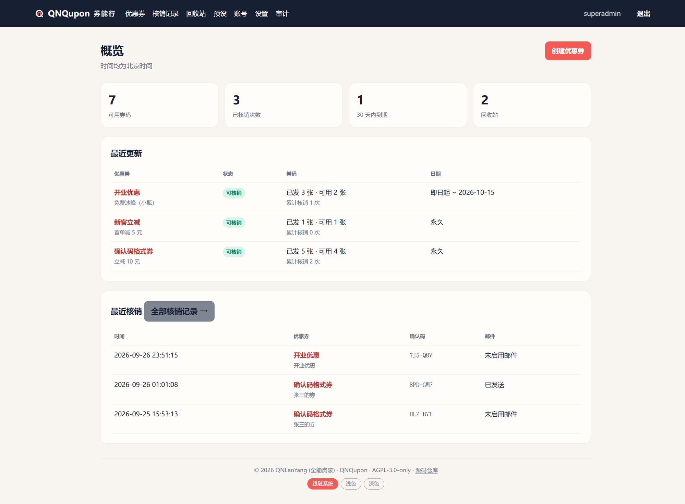
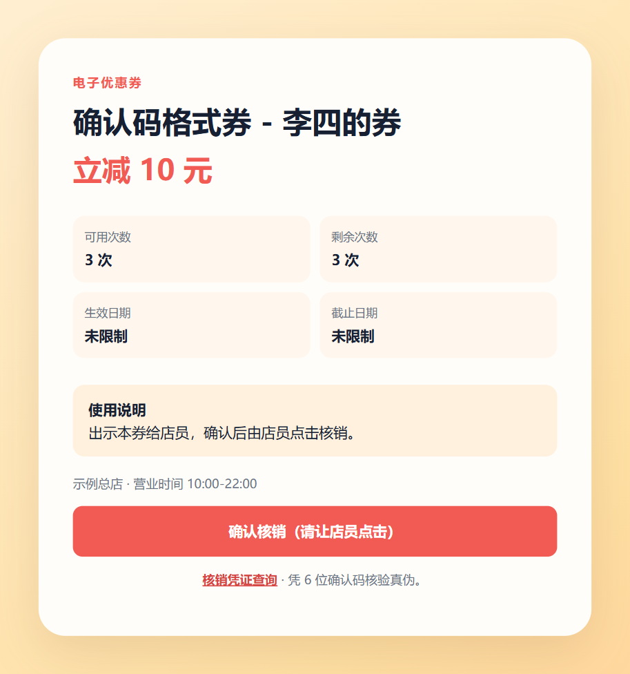
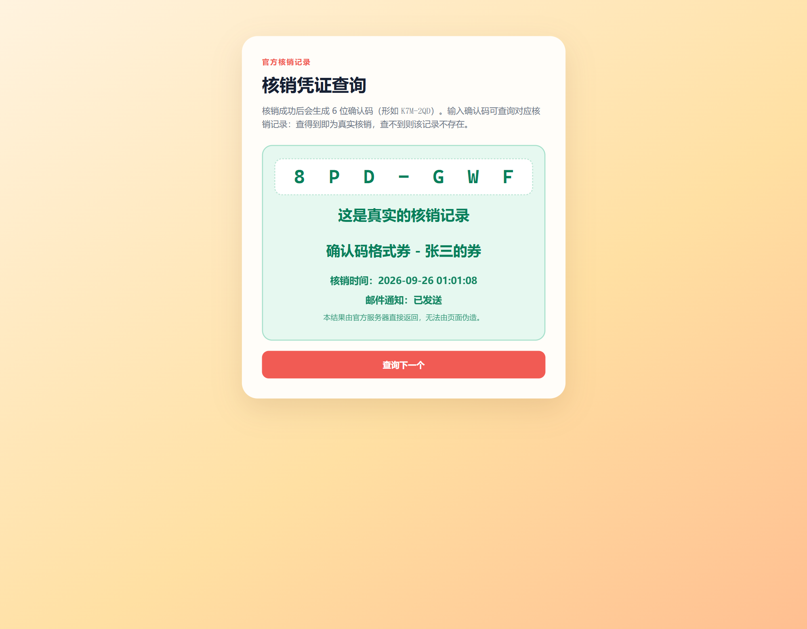

<p align="center"></p>

<h1 align="center">QNQupon · 券能行</h1>

> 面向熟人和小型商家的**自托管不记名优惠券系统**。一张优惠券是「券面」（优惠内容、有效期、总次数），券面下可创建多张「券码」——各自拥有独立的核销链接、二维码与 6 位确认码，分别发给不同的客人。系统只对外公开券码页与凭证查询页；管理后台仅对白名单内的 Host 开放（`localhost` / `127.0.0.1` 恒放行），默认不对外暴露。

**English** · A lightweight self-hosted voucher system: a coupon = one *face* + multiple *codes*, each code with its own link / QR code / 6-digit confirmation code. Redemption is atomic, and anyone can verify a redemption at `/verify`. Single Node.js process, SQLite storage, no external services. Docs are currently Chinese-only.

**技术栈**：Fastify · SQLite（WAL）· better-sqlite3 · 原生 HTML/CSS/JS（零构建） · Node.js 22+ ｜ **License**：AGPL-3.0-only

## 效果截图

| 管理后台（概览） | 客人核销页 |
| --- | --- |
|  |  |

| 核销凭证查询 | PNG 券面 |
| --- | --- |
|  |  |

## 两级模型：券面 + 券码

举例：门店做「满 100 减 20」活动（**券面**），要分别发给张三、李四、王五各一张、每人一次——在券面下创建 3 张**券码**，每张有独立链接/二维码/确认码，可单独停用、单独看核销记录，备注写"发给谁"（仅后台可见）。

- **券面**（自增 ID）：名称、优惠内容、说明、门店文案、起止日期、每张券码可用次数、状态
- **券码**（`cd-` + 12 位随机 ID，不可枚举、不暴露数量）：名称（可重复，仅作展示；客人核销页默认显示「券面名 - 券码名」，可按全局开关或单张覆写隐藏）、备注（后台可见）、256 bit Token、已用次数、状态
- 停用或回收券面会联动使其下全部券码失效；到期/用尽满 30 天自动进回收站，回收站满 30 天永久删除（默认值，天数在后台可调）

## 主要特性

### 券与核销

> [!IMPORTANT]
>
> 本系统被设计为 **任何拿到优惠券上二维码的人扫码后都可以点击“核销”并实际扣除对应券码的使用次数**。
>
> 所以优惠券可能会在被实际使用前就被“核销”用尽，这是故意设计的，为什么要这么做请看文档：**[架构与设计决策](docs/ARCHITECTURE.md)**。

- **原子核销**：`UPDATE ... WHERE` 条件扣减次数，绝不由 GET 改变状态；并发抢兑只有"次数"那么多能成功
- **五色状态徽章**：可核销（绿）、已用尽/已过期（黄）、未到开始时间（蓝）、已禁用（红）、回收站（灰）
- **确认码防伪**：每次核销生成 6 位确认码（字符集 32⁶ ≈ 10 亿空间），可到公开页 `/verify` 输入确认码，查询服务器上的真实核销记录——结果页以确认码为小标题，突出真伪结论、券面/券码、核销时间与邮件通知状态；确认码默认保留 72 小时可查（时长后台可调）
- **生命周期**：每小时维护自动回收；全程按 `Asia/Shanghai` 自然日判断，页面时间统一北京时间
- 中文移动端券码页、全站浅色/深色三态主题（跟随系统/浅色/深色，页脚一键切换）、二次确认核销（防误触）、直白的失败原因、多次券完整核销历史

**查券接口**：`GET /api/verify/:code` 是上方防伪查询的机器可读版，供店员脚本或第三方核对，无需登录；确认码不区分大小写、`-` 可省略。与查询页各自限流 30 次/分/IP，不带 CORS 头（别的域名的浏览器读不到，适合服务端调用），只回最小字段。

```bash
curl https://coupon.example.com/api/verify/K7M-2QD
# 已核销且在可查窗口内（默认 72 小时，后台可调）：
# {"found":true,"confirmationCode":"K7M-2QD","faceName":"满 100 减 20","codeName":"张三","redeemedAt":"2026-09-27T12:34:56.000Z","redeemedAtBeijing":"2026-09-27 20:34:56"}
# 查不到、超出可查窗口或从未核销——统一中性返回，不泄露具体原因：
# {"found":false,"confirmationCode":"K7M-2QD"}
# 确认码格式不对：HTTP 400 {"error":"确认码格式不对，应为 6 位字母数字（形如 K7M-2QD）。"}
```

### 管理后台
- **两级账号**：超级管理员（系统/SMTP/备份/账号/审计）与业务管理员（仅券和预设）；越权访问得到 403「权限不足」页而非弹回登录页
- 每张券码独立二维码与链接：一键复制、打开核销页、预览或下载 1080×1920 PNG 券面（文件名「优惠券-券面名-券码名」，不含内部 ID）；服务设置可全局开关「券码名是否出现在 PNG 与客人核销页」（默认显示），单张券码可单独覆写
- 券面详情页创建券码：生成数量填 1 = 单张（名称原样使用）；填多张 = 批量生成，名称自动加编号——编号位数与数量同宽（9 张 → `#1`…`#9`，20 张 → `#01`…`#20`，100 张 → `#001`…`#100`），未填名称则以券面名作基名、编号同样补零；批量券码名统一设为不在券面 PNG 与客人核销页显示，可到单张详情页改回
- 回收站（券面/券码两栏、一键恢复、超管勾选确认后永久删除）、核销记录总页（概览「最近核销」+ 按券面与日期筛选、分页）、操作审计（含失败登录，按类别/账号/日期筛选、分页）、预设模板、优惠券列表与概览统计
- 所有危险操作走页面内模态确认框，不依赖 `window.confirm`（不被 WebView 拦截）
- 后台可「装到桌面」当 App 用：手机浏览器菜单 → 安装应用 / 添加到主屏幕，之后是独立窗口、没有地址栏，状态栏颜色跟随主题（作用域只到后台，客人页仍归浏览器）

### 通知与输出

- 核销即发通知邮件（SMTP 密码 AES-256-GCM 加密存储；已在真实 SMTP 验证可用）；邮件失败不回滚核销
- PNG 券面在**独立子进程**按需渲染：不缓存、串行压峰值、60 秒空闲自动退出，把内存全额还给系统
- 每日 SQLite 一致性备份（backup API），保留份数后台可调

### 安全
- 公开面信息最小化：Token 256 bit 只存哈希、后台 HTML 零暴露；查询页只回「券面名 - 券码名 - 时间 - 邮件状态」，绝不返回 IP/UA/备注
- 全站严格 CSP + `nosniff` / `X-Frame-Options: DENY` / `no-referrer` / `no-store` 等响应头，敏感写操作分级限流（阈值可经 `.env` 的 `RATE_LIMIT_*` 调整），失败登录写审计
- 登录页可选接入 Cloudflare Turnstile 人机验证：token 回源校验并核对来源域名，通过后才进登录限流与密码校验（`.env` 的 `TURNSTILE_*` 配置，默认关闭；CSP 仅登录页放行该源；回源网络抖动带幂等键自动重试一次）
- 真实 IP 信任链（`TRUST_PROXY`），保证限流分桶与核销 IP 记录准确
- 完整威胁模型、防护清单与"明确不做的防护"见 [SECURITY.md](SECURITY.md)

## 快速开始

```powershell
# 1. 准备 .env
copy .env.example .env
#    为 APP_ENCRYPTION_KEY 与 SESSION_SECRET 各填入一串随机字符串：
#    二者是机密，必须足够随机、足够长（建议 32 位以上）；
#    生成方式不限——node\node.exe scripts\generate-secrets.js 可一次生成两串，
#    也可自行敲入一长串字符，或使用任意在线随机字符串生成器均可

# 2. 安装依赖
node\npm.cmd ci --cache .npm-cache

# 3. 启动
node\node.exe src\server.js

# 4. 首次启动：终端会输出可直接点开的 /admin/setup 链接与一次性口令，
#    打开并用口令创建唯一超级管理员
```

- 需要 [Node.js 22+](https://nodejs.org/zh-cn/download)（Windows 可直接用外置 `node/` 目录，Linux/macOS 用系统 Node 即可）
- `node/`、`.env`、`data/`（数据库与备份）、`.npm-cache/` 均不入库
- 手机扫码联调、测试账号、辅助脚本见 [docs/DEVELOPMENT.md](docs/DEVELOPMENT.md)

## 生产部署

- Node 默认只监听 `127.0.0.1:3100`，建议置于反向代理（Nginx、Caddy 等）之后对外提供服务
- 建议对外只暴露公开路径（`/`、`/r/`、`/verify`、`/api/verify/`、`/assets/`）；`/admin` 与 `/healthz` 不对外，应用另有 Host 白名单兜底（`localhost` / `127.0.0.1` 恒放行，其余按需写入 `ADMIN_HOSTS`）
- 反向代理必须**透传 `Host`**、**覆盖式写 `X-Forwarded-For`**，并在 `.env` 设 `TRUST_PROXY`——限流分桶与审计才能拿到真实客户端 IP
- Nginx 参考配置（路径白名单、覆盖式 XFF、粗限流）：[`docs/nginx/`](docs/nginx/)
- 完整步骤（.env 逐项说明、启动后台、作为服务运行、备份恢复演练、常见问题）：[docs/DEPLOYMENT.md](docs/DEPLOYMENT.md)

## 测试

```powershell
node\node.exe --test     # 或 npm test（node 在 PATH 时）
```

测试覆盖安全性、两级状态机与联动、原子核销、回收生命周期、核销记录与审计的筛选分页、时区边界、信息最小化与转义、券面 PNG 渲染、三态主题、人机验证。详见 [docs/DEVELOPMENT.md](docs/DEVELOPMENT.md)。

## 项目文档

| 文档 | 内容 |
| --- | --- |
| [docs/ARCHITECTURE.md](docs/ARCHITECTURE.md) | 数据模型、Token 设计、状态机、渲染子进程等设计决策 |
| [SECURITY.md](SECURITY.md) | 威胁模型、防护清单、IP 信任链、漏洞上报方式 |
| [docs/DEPLOYMENT.md](docs/DEPLOYMENT.md) | 生产部署、.env 逐项说明、备份恢复演练 |
| [docs/DEVELOPMENT.md](docs/DEVELOPMENT.md) | 开发环境、测试、辅助脚本、代码约定 |
| [CHANGELOG.md](CHANGELOG.md) | 变更日志 |
| [CONTRIBUTING.md](CONTRIBUTING.md) | 贡献指南 |

## 路线图

- [ ] Docker / Compose 部署
- [ ] 人机验证（`/verify` 出现滥用迹象时启用）
- [ ] 更多截图与演示动图
- [ ] （可选）管理员两步验证

## License

[AGPL-3.0-only](LICENSE) © 2026 QNLanYang (全能岚漾)
